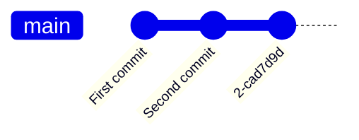
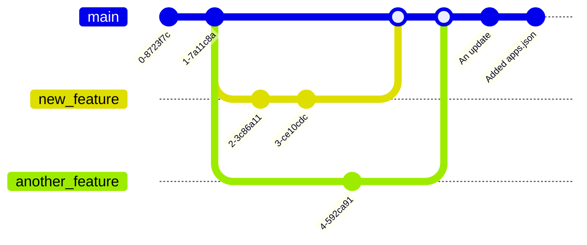

---
tags:
  - Git
---

# What is Git?

---

## Git is a distributed version control system

It tracks versions of files, maintains branching and many more!

---

## How to use git?

Git has many sub commands, they are all useful in their own unique ways.

In this short tutorial, only the essentials commands and functions of git would be demonstrated.

---

# Before staring

## Lets learn the terms

---

## 1. Head and commits

---

Head/Main means the first commit of the repository.

A commit is each submitted change on a branch.

---

## Example graph

^f72366

---

Each commit comes with its own unique hash.

![[Git#^f72366]]

---

The first two commits are committed with comments.

![[Git#^f72366]]

---

Comments are not a must but it is generally advised to have.

![[Git#^f72366]]

---

## 2. Branches

---

## Example graph 2

^3970a7

---

![[Git#^3970a7]]

As you can see three branches are present.

- main
- new_feature
- another_feature

---

![[Git#^3970a7]]

Both branch `new_feature` and `another_branch` are forked from the `main` branch, inheriting every file from `main`.

---

## 3. Merging

---

![[Git#^3970a7]]

The new features implemented in those 2 branches only exists on their own branch.

So what would we do when we want the `main` branch to have those feature updates?

---

### We merge them together

---

## Example graph 3

^957b53

---

![[Git#^957b53]]

Now, the `main` branch has the features added `new_feature` and `another_feature`.

---

## 4. Checkout

---

![[Git#^957b53]]

The branch that we are currently on is the `main` branch, if we want to change to the other branches, we would use the checkout sub-command.

---

After checking-out to the main branch, I've created a new commit with the message: "An update" in the main branch.

---

## 5. Staging and adding files

---

Now that we have learned how to navigate inside a git repository, it's time to see how we can add files to an existing one.

---

## Example graph 4

In this graph, I've added a new file called `apps.json` and committed this change to the repository with the message: "Added apps.json".