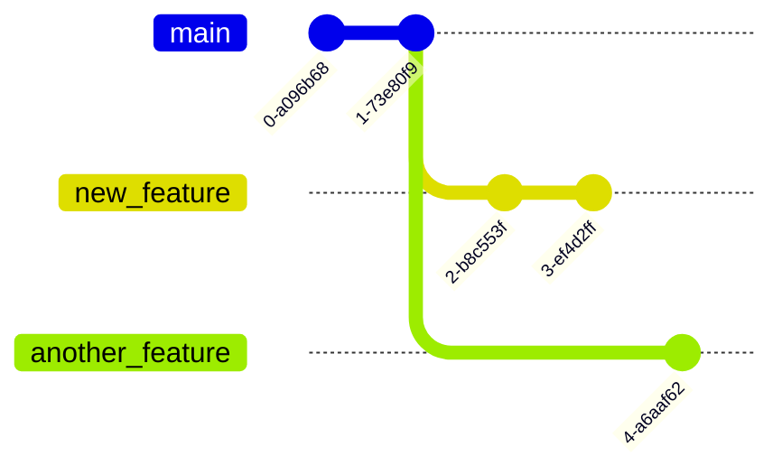
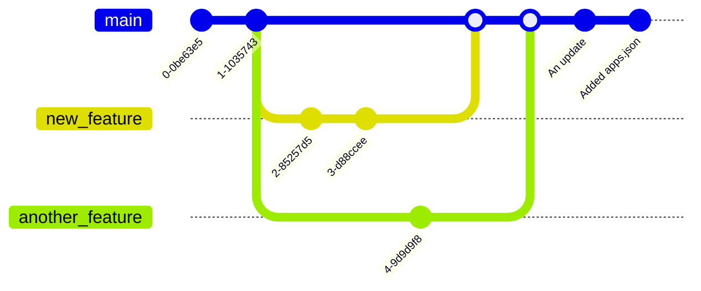

---
tags:
  - Git
---

# What is Git?

---

## Git is a distributed version control system

It tracks versions of files, maintains branching and many more!

---

## How to use git?

Git has many sub commands, they are all useful in their own unique ways.

In this short tutorial, only the essentials commands and functions of git would be demonstrated.

---

# Before staring

## Lets learn the terms

---

## 1. Head and commits

---

Head/Main means the first commit of the repository.

A commit is each submitted change on a branch.

---

## Example graph


^f72366

---

Each commit comes with its own unique hash.

![[Git#^f72366]]

---

The first two commits are committed with comments.

![[Git#^f72366]]

---

Comments are not a must but it is generally advised to have.

![[Git#^f72366]]

---

## 2. Branches

---

## Example graph 2



^3970a7

---

![[Git#^3970a7]]

As you can see three branches are present.

- main
- new_feature
- another_feature

---

![[Git#^3970a7]]

Both branch `new_feature` and `another_branch` are forked from the `main` branch, inheriting every file from `main`.

---

## 3. Merging

---

![[Git#^3970a7]]

The new features implemented in those 2 branches only exists on their own branch.

So what would we do when we want the `main` branch to have those feature updates?

---

### We merge them together

---

## Example graph 3


^957b53

---

![[Git#^957b53]]

Now, the `main` branch has the features added `new_feature` and `another_feature`.

---

## 4. Checkout

---

![[Git#^957b53]]

The branch that we are currently on is the `main` branch, if we want to change to the other branches, we would use the checkout sub-command.

---


After checking-out to the main branch, I've created a new commit with the message: "An update" in the main branch.

---

## 5. Staging and adding files

---

Now that we have learned how to navigate inside a git repository, it's time to see how we can add files to an existing one.

---

## Example graph 4



In this graph, I've added a new file called `apps.json` and committed this change to the repository with the message: "Added apps.json".

---

# Git Command Line

---

Now that you have seen what git does,

let's learn how to use git!

---

## 1. Initialising a git repository

---

Firstly you need to set a username and email account to be used for git.

```bash
git config user.name "Your Name"
git config user.email "YOUR EMAIL"
```

If you don't have an email, you can put in a fake one.

---

```bash
git init
```

This would initialise a git repository inside your current directory.

---

Run this command to see the current status of the repository.

```bash
git status
```

You can always run this command every time you want to check the status of your repository.

---

```bash
ls -AF
.git/
```

A `.git` directory is created.

This is where git stores all your commits, branches and tags.

You would not interact with this directory in normal use cases.

---

## 2. Committing changes

---

By default, the git repository is empty on creation and the branch that git uses is called `master`.

Let's create a file too see how to commit this change!

---

```bash
touch file.txt
```

Now you have to add the file to the stage for committing.

```bash
git add file.txt
```

---

```bash
git status
```

```
On branch master

No commits yet

Changes to be committed:
  (use "git rm --cached <file>..." to unstage)
	new file:   file.txt


```

As you can see `file.txt` is now ready to be committed.

---

```bash
git commit -m "My first commit"
```

---

You can see all your commit history with this command:

```bash
git log
```

```
commit 41657921e8dcef44d20e71c46ed926ce874a6f42 (HEAD -> master)
Author: NAME <EMAIL>
Date:   Fri Jun 27 15:48:36 2025 +0800

    My first commit
```

---

Now let's put something into `file.txt` and commit it.

`file.txt`:

```
Hello World
```

And now you would try committing it yourself.

---

### 2.1 Reverting a commit

---

If for some reason you need to undo a commit, you can use the `revert` command:

First you have to get the hash of the commit you'd like to go back to.

Use `git log` and copy the hash.

---

How to revert to that commit.

```bash
git revert COMMIT_HASH
```

---

Running the following commands, you can see that you have reverted to a previous commit.

```
git log
```

```
git status
```

---

## 3. Branching

---

To create a new branch run this:

```bash
git branch <BRANCH_NAME>
```

---

### 3.1 Check-outing other branch

---

If you need to switch to another branch, you can use the `checkout` command:

```bash
git checkout <BRANCH_NAME>
```

---

## 4. Merging

---

When you have implemented some changes on your branch and would like to add it those commits to another branch,

you can use the `merge` command.

```bash
git checkout main
git merge <BRANCH_NAME>
```

You'll have to checkout to the branch you want to merge first.

---

## 5. Working with remote repository

---

### 5.1 Cloning

In this tutorial, we'll use the GitHub repository as an example.

```bash
git clone https://github.com/Po1-Robotics-Training/linux-tutorial.git
```

After which you can `cd` into the directory.

---

### 5.2 Fetching/Puling

---

To receive new changes that happened on the remote repo.

```bash
git fetch
```

This would update your local machine with the new changed.

However it does not automatically apply those updates to your branch.

---

This is where you can use the `pull` command.

The pull command does 2 things:
1. run `git fetch` to receive updates
2. run a merge with the remote branch

```bash
git pull
```

---

### 5.3 Pushing

---

After committing your changes to the local copy of the remote branch.

```bash
git push
```

Remember, first commit your changes and then push if you have to.